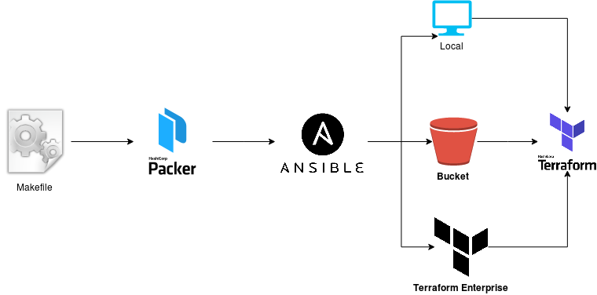
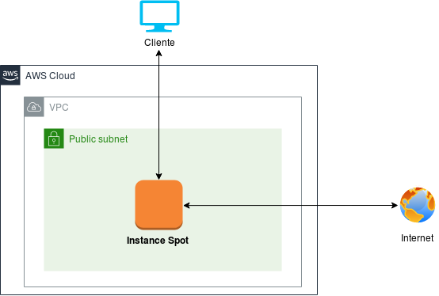

# AWS VPN ANON
[](https://opensource.org/licenses/Apache-2.0)

Despliega tu propia red VPN (Point-to-Point) para salvaguardar tu privacidad, anonimato y sin limitaciones.

La instancia que se desplegara será de tipo spot (https://aws.amazon.com/es/ec2/spot/). En cuanto al dspliegue el estado de terraform puede ser guardado en un bucket aws s3 (https://www.terraform.io/docs/backends/types/s3.html), terraform enterprise (https://www.terraform.io/docs/enterprise/index.html) y de manera local, al momento de desconectarse de la VPN se eliminará de manera automatica la infraestructura y el estado de terraform (tfstate).

## Requisitos
    - Cuenta AWS secret-access key
    - Packer https://www.packer.io/downloads.html
    - Ansible https://www.ansible.com/resources/get-started
    - Terraform https://www.terraform.io/downloads.html
    - Centos 7 (en caso de tener otro sistema operativo deberas editar la linea 184 del archivo Makefile "sudo yum install -y ppp pptp pptp-setup")

## Variables Requeridas
| Name | Description | Type | Default | Required |
|------|-------------|:----:|:-----:|:-----:|
| REGION | Region de despliegue de infraestructura.. | string | us-east-1 | yes |
| TYPE | El tipo de servidor para la conexión VPN. standar/advance/high | string | standar | yes |
| SUBNET | La Subnet en la que se desplegara la infraestructura (requerida - PUBLIC). | string | n/a | yes |
| TFSTATE | Especificar si el tfstate se guardara en s3(bucket), enterprise(terraform) o local (https://www.terraform.io/docs/state/) | string | local | yes |

## Ejecución
```hcl
make quickstart
```

## Desconección
```hcl
make disconnect 
```

## Deployment


## Infraestructura
